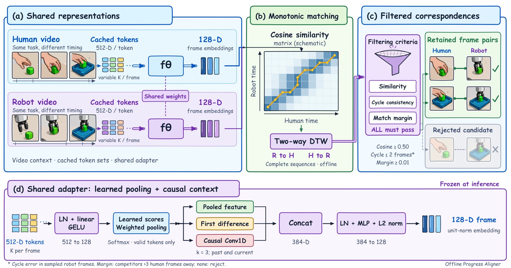
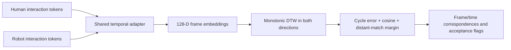

# Offline Progress Aligner

Match frames at similar action progress in a **same-task human/robot video pair**, then filter ambiguous correspondences. The input to this package is each video's cached **512-dimensional interaction tokens**, not raw video pixels.

[中文说明](README_zh.md) · [Model card](MODEL_CARD.md) · [Feature format](docs/FEATURE_FORMAT.md) · [Training](docs/TRAINING.md)



*Method overview (offline inference). Videos illustrate the upstream source; this package reads token caches. The shared adapter maps each frame's token set to a unit-norm 128-D embedding. Both complete sequences enter DTW; all three filters must pass before a correspondence is retained. Scene drawings and matrix colors are schematic, and acceptance is not a verified semantic label.*

[Editable SVG](assets/overview.svg) · [Vector PDF](assets/overview.pdf) · [PNG preview](assets/overview.png) · [Figure provenance and corrections](assets/hero-prompt.md)



## What is released

- The trained **step 8308** adapter: **182,657 parameters**, 731,852-byte safetensors file, with SHA-256 metadata.
- The same temporal adapter, DTW inference and filtering used by our frozen offline alignment pipeline.
- CPU inference CLI/API, JSON/CSV export, input validation and tests.
- The original self-supervised objective and a portable reference training entry point.

The adapter was pretrained on H&R (called H2R in our experiments), then adapted on RH20T. Its final-stage sampler visited **6,550 distinct RH20T training pairs**. This is not a claim of training on the entire RH20T corpus. See the [verified coverage and loss definitions](MODEL_CARD.md).

The visual token extractor is a separate prerequisite and is **not included**. An arbitrary 512-D vector from another encoder is not a compatible substitute. The released checkpoint records the expected feature-space identity; using a different encoder requires adaptation/retraining. For a software-only smoke test, use the synthetic example below.

## Install

Python 3.10+ is required. No GPU is needed for alignment.

```bash
git clone https://github.com/primorLee/offline-progress-aligner.git
cd offline-progress-aligner
python -m pip install -e ".[test]"
python -m pytest -q
```

The small weight file is included in `weights/`; it does not require Git LFS or a separate model download. Install your preferred PyTorch build first if you need to control CPU/CUDA packaging.

## Align and filter

Prepare two NPZ files using the [feature contract](docs/FEATURE_FORMAT.md), then run:

```bash
python -m offline_progress_aligner align --human human.npz --robot robot.npz --weights weights/aligner_step008308.safetensors --output output/alignment.json
```

This writes `alignment.json` and `alignment.csv`. Each robot sample has a matched human sample/frame, optional human timestamp, cosine similarity, round-trip error, distant-candidate margin and an `accepted` flag. JSON also preserves the full path and the indices passing all filters. Timestamps use each video's own clock; the two videos may have different durations or sampling rates.

```python
from offline_progress_aligner import OfflineProgressAligner, TokenSequence

aligner = OfflineProgressAligner.from_checkpoint("weights/aligner_step008308.safetensors")
result = aligner.align(TokenSequence.load("human.npz"), TokenSequence.load("robot.npz"))
accepted_indices = result["accepted_robot_sample_indices"]
```

Default acceptance gates reproduce the existing exporter:

| Check | Threshold |
|---|---:|
| Robot→human→robot round-trip error | ≤ 2 sampled robot frames |
| Matched-frame cosine similarity | ≥ 0.50 |
| Margin over the best distant human candidate | ≥ 0.01 |
| Human neighbors excluded from that competitor search | within 3 sampled human frames |

All gates must pass. When no distant competitor exists, confidence is undefined and the sample is rejected. Thresholds are configurable with `--max-cycle-frames`, `--min-cosine`, `--min-margin` and `--exclude-radius`. These are **heuristic gates, not calibrated correctness probabilities**; their frame units depend on sampling density.

## Try without data

```bash
python examples/synthetic_demo.py --output demo_inputs
python -m offline_progress_aligner align --human demo_inputs/human.npz --robot demo_inputs/robot.npz --weights weights/aligner_step008308.safetensors --output demo_output/alignment.json --allow-feature-mismatch
```

The example produces synthetic random tokens with a known time warp. It checks software operation only, not real human–robot semantic accuracy. `--allow-feature-mismatch` is explicit here because synthetic tokens are outside the trained feature space; the output marks that fact.

## Scope

Both complete sequences are available offline. Although the adapter's convolution uses only preceding samples, the DTW path uses the whole robot sequence. This is **not an online progress predictor**, task recognizer, policy or world model. Supply a same-task pair with comparable start/end stages: endpoint-constrained DTW will produce a path even for unrelated or incomplete videos. Repeated actions, occlusion, omitted steps and bad object regions can still yield incorrect matches. Review held-out semantic events before using the accepted pairs as training labels.

## License and attribution

Original code: [MIT](LICENSE). Released weights: [CC BY-NC 4.0](weights/LICENSE.md), reflecting RH20T's non-commercial model-use condition. Dataset and upstream encoder assets are not redistributed. The training objective uses attributed HOST SmoothDTW code; see [third-party notices](THIRD_PARTY_NOTICES.md). This package is an independent relation-feature adapter, not an official HOST release.
